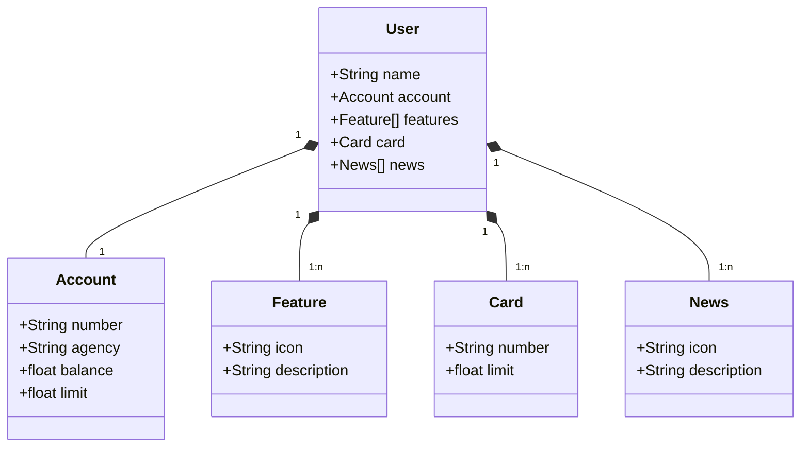

# GFT Bootcamp Deploy

## Descrição do Projeto

Este projeto é uma aplicação de exemplo desenvolvida durante o Bootcamp da GFT. A aplicação gerencia informações de usuários, contas bancárias, funcionalidades, cartões e notícias. Utiliza Spring Boot para a construção do backend e PostgreSQL como banco de dados.

## Diagrama de Classes

## Entidades Principais
- User: Representa um usuário do sistema, com informações pessoais e relacionamentos com outras entidades.
- Account: Representa uma conta bancária associada a um usuário, incluindo número, agência, saldo e limite.
- Feature: Representa funcionalidades adicionais que um usuário pode ter acesso, identificadas por ícone e descrição.
- Card: Representa um cartão associado ao usuário, contendo número e limite.
- News: Representa notícias ou atualizações exibidas ao usuário, identificadas por ícone e descrição.

## Tecnologias Utilizadas
- Java 17
- Spring Boot
- PostgreSQL
- Maven
- Docker

## Deploy 
- Render
- Link swagger: https://gft-bootcamp-deploy.onrender.com/swagger-ui/index.html
- Disponível até: 08/07/2024
